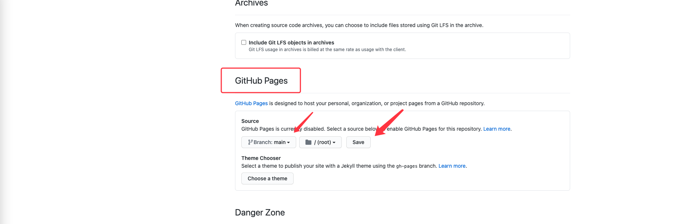

# 程序媛汇介绍
程序媛汇 Coding Girls Club (CGC)诞生于 2016 年 6 月 1 日，是一家为女性数字化赋能为己任的社会企业。CGC 通过编程科普、启蒙工作坊、职业培训等线上线下结合的形式，鼓励更多女性体验编程并进入 STEM 领域。至今，CGC 已在全国 10 个城市举办了超过 20 场编程城市活动，并联合全国 17 所高校举办“一日编程”活动，累计参与的学员近 4000 人，得到了来自中国日报、环球时报、CCTV 等媒体的报道关注。2018 年，CGC 入选由联合国开发计划署发起的“科技与慈善”项目案例集，2019 年成为共青团中央"全国青年社会组织「伙伴计划」"获奖项目。CGC 聚集着一群正直、善良且富有才华的小伙伴，致力建构互联互助的信息学习平台，为女性和女性自我提升数字化赋能，我们相信数字赋能女性，多元改变世界。
官网：http://codingirlsclub.com/about


# 学员手册
* [搭建网站](#搭建网站)
  * [网站效果预览](#网站效果预览)
  * [注册 Github 账号](#注册-github-账号)
  * [使用博客模版来创建属于自己的 git 仓库](#使用博客模版来创建属于自己的-git-仓库)
  * [配置 GitHub Pages](#配置-github-pages)
* [自定义网站内容](#自定义网站内容)
  * [修改 baseurl](#修改-baseurl)
  * [修改网站的主题和标题](#修改网站的主题和标题)
  * [提交更改合并到 git 仓库的主分支](#提交更改合并到-git-仓库的主分支)
* [上传图片](#上传图片)
* [发布, 更改, 删除文章](#发布-更改-删除文章)
  * [文章内容开头模版](#文章内容开头模版)
  * [发布新文章](#发布新文章)
  * [更改文章](#更改文章)
  * [删除文章](#删除文章)
* [小知识](#小知识)
  * [什么是 Jekyll ?](#什么是-jekyll-)

# 搭建网站
## 网站效果预览


## 注册 Github 账号
请点击这里[注册 GitHub](https://github.com/join?ref_cta=Sign+up&ref_loc=header+logged+out&ref_page=%2F&source=header-home), 注册成功之后，登录 GitHub。  
如果你已经有 GitHub 账户，请跳过这一步！  

## 使用博客模版来创建属于自己的 git 仓库
### 1. 登录到 GitHub 之后，点击 [Girls-Coding-Day-Jekyll-blog-1](https://github.com/CodingGirlsClub/Girls-Coding-Day-Jekyll-blog-1) 进入仓库, 点击右上角的 `Use this template` 按钮。  


### 2. 填写仓库名称, 仓库简介, 选择仓库类型为 Public, 勾选 Include all branches. 点击 `Create repositorye from template` 按钮  


### 3. 仓库创建成功


## 配置 GitHub Pages
### 1. 找到 `Settings` 选项, 点击 `Settings`


### 2. 将 `Settigns` 页面下拉, 找到 `GitHub Pages` 设置区域. 点击 `Source` 下面的下拉框，选择 `main` 分支之后，点击 `Save` 按钮:  


### 3. 点击 `Save` 按钮之后会出现相应的博客访问地址.  
:warning: _地址还不可访问, 因此打开页面会出现 404 (找不到该页面)_
  


# 自定义网站内容
### 1. 点击并打开 [`_config.yml`](_config.yml) 文件  

### 2. 点击 铅笔 按钮进入编辑模式  


## 修改 baseurl
将默认 `_config.yml` 中:  

```
# "/" + 仓库的名字. 资源文件的路径组成部分
baseurl: "/Girls-Coding-Day-Jekyll-blog-1"
```

修改为自己的仓库名称, 例如你的仓库名称为 `my-first-blog`:  
:warning: _可以在 [使用博客模版来创建属于自己的-git-仓库](#2-填写仓库名称-仓库简介-选择仓库类型为-public-勾选-include-all-branches-点击-create-repositorye-from-template-按钮) 找到你的仓库名称_ 😉

```
# "/" + 仓库的名字. 资源文件的路径组成部分
baseurl: "/my-first-blog"
```

## 修改网站的主题和标题
修改 `_config.yml` 中 `title`, `name`, `description` 的值, 将其替换为你需要的值:  

```
# 网页的标题
title: "Girls Coding Day"

# 网站副标题
subTitle: "Girls Coding Day"
```

例如:  

```
# 网页的标题
title: "xx 的小世界"

# 网站副标题
subTitle: "记录我的生活，学习和工作感悟 🥳"
```

> **注意事项 ⚠️**
> 1. `_config.yml` 文件中使用的都是英文标点, 请不要使用中文标点;
> 2. 冒号后面有一个空格;
> 请严格遵守上述要求, 否则网站配置会不成功, 导致无法访问;

## 提交更改合并到 git 仓库的主分支
### 1. 下拉网页看到提交信息填写部分, 填写标题和提交的简单介绍信息


### 2. 填写完整相应的信息, 点击 `Commit changes` 按钮  


# 🎉 恭喜你 🎉 :smirk: 到这里, 你就可以通过网址来访问自己的网站啦!!!  
🥳🥳🥳 网站地址可以在这里找到 [点击-save-按钮之后会出现相应的博客访问地址](#3-点击-save-按钮之后会出现相应的博客访问地址)  

:warning: _可能由于 GitHub Pages 有延迟和缓存的问题，你需要等一会儿访问, 3~5 分钟不等_

# 上传图片  
## 1. 下载图片素材
## 2. 打开图片目录, 进入到 [`assets/images`](assets/images) 文件夹下

  

## 3. 点击 `Add file` 按钮, 选择 `Upload files` 按钮  
  

## 4. 选择你电脑本机需要上传的图片  
  

:warning: _图片需要提前下载到本地, 图片名称**不要**包含空格_  

## 5. 填写提交信息, 点击 `Commit changes` 按钮  
  

## 6. 等待图片上传  


## 7. 查看图片结果  


# 发布, 更改, 删除文章
## 文章内容开头模版
```yml
---
title:  "道码旦・由来"
subtitle: "关注我们公众号/微博：codingirlsclub"
author: "吾塘"
avatar: "assets/images/authors/logo.jpg"
image: "assets/images/001.jpg"
---
```

## 发布新文章
### 1. 点击 [`_post`](_posts) 文件夹进入文章列表页面  

### 2. 点击 `Add file` 按钮, 选择 `Create new file`  

### 3. 添加文章名称, 添加文章内容, 编写完成之后点击 `Commit file` 按钮


> **文章标题 注意事项 ⚠️**  
> 在编辑页面输入文章名称，名称符合如下格式:  
> - 文件名必须以日期开头，如`2021-03-01`
> - 文件名必须使用英文命名，多个单词之间用中划线`-`连接
> - 日期与英文之间用`-`中划线连接
> - 文件名必须以`.md`结尾

例如: `2021-03-01-hello-world.md`  

> **文章内容 注意事项 ⚠️**  
> 在编辑页面输入文章内容，需要符合如下格式:  
> - 文章必须以
```yml
---
title:  "道码旦・由来"
subtitle: "关注我们公众号/微博：codingirlsclub"
author: "吾塘"
avatar: "assets/images/authors/logo.jpg"
image: "assets/images/001.jpg"
---
```

> 开头

其中:  
1. `title, subtitle, author` 的值可以替换为其它内容, 标题的值必须用双引号 `"` 包住  
2. `image` 的内容来自于 [assets/images](assets/images) 文件夹下, 你可以上传本地. 详细方法见 [上传图片](#上传图片)  


添加文章成功之后, 别忘了访问网站查看效果 :raised_hands:  
🥳🥳🥳 网站地址可以在这里找到 [点击-save-按钮之后会出现相应的博客访问地址](#3-点击-save-按钮之后会出现相应的博客访问地址)  

:warning: _可能由于 GitHub Pages 有延迟和缓存的问题，你需要等一会儿访问, 3~5 分钟不等_

## 更改文章
### 点击 铅笔 进行文章的更新, 填写完成之后点击 `Commit changes` 按钮  


更改文章成功之后, 别忘了访问网站查看效果 :raised_hands:  
🥳🥳🥳 网站地址可以在这里找到 [点击-save-按钮之后会出现相应的博客访问地址](#3-点击-save-按钮之后会出现相应的博客访问地址)  

:warning: _可能由于 GitHub Pages 有延迟和缓存的问题，你需要等一会儿访问, 3~5 分钟不等_  

## 删除文章  
### 点击 垃圾箱 进行文章的删除  


### 填写相应信息, 点击 `Commit changes` 按钮  


删除文章成功之后, 别忘了访问网站查看效果 :raised_hands:  
🥳🥳🥳 网站地址可以在这里找到 [点击-save-按钮之后会出现相应的博客访问地址](#3-点击-save-按钮之后会出现相应的博客访问地址)
  
:warning: _可能由于 GitHub Pages 有延迟和缓存的问题，你需要等一会儿访问, 3~5 分钟不等_

# 小知识
## 什么是 Jekyll ? 
Jekyll 是一个简单的博客形态的静态站点生成器。它有一个模版目录，其中包含原始文本格式的文档，通过一个转换器（如 Markdown）和我们的 Liquid 渲染器转化成一个完整的可发布的静态网站，你可以发布在任何你喜爱的服务器上。Jekyll 也可以运行在 `GitHub Page` 上，也就是说，你可以使用 GitHub 的服务来搭建你的项目页面、博客或者网站，而且是完全免费的。  
我们的网站就是基于 Jekyll 并运行在 `GitHub Page` :) 

到这里，相信你已经有了自己的网站，同时发表了自己的博客哦！
